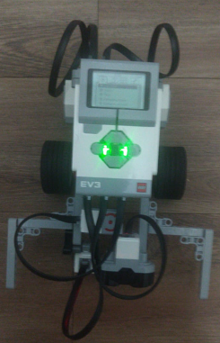

# Room Explorer and Object finder Robot

## Software Design

## Path Planning
### Basic Algorithm Approach
* Basic Intuition helped us decide that it will be very complex to derive a systematic movement algorithm and design to guide the robot to cover whole maze without knowing maze layout.
* From any early systematic strategies, I came up that generalizing them might not be possible without avoiding the chance of being stuck in a loop based on the maze layout.
* So, I decided on the implementing an algorithm that would imitate the path covered by a ball bouncing of the walls.

### Ball Bouncing Algorithm
* As to cover the whole maze without being stuck in loops I needed some level of randomness in our algorithm design I decided on imitating the path of a ball bouncing of the walls for our robot.
* If a ball was to bounce of the walls of the maze without losing any of its speed and energy due to collisions with walls it should in theory cover the whole maze if it bounces of at the correct angle.
* As seen in the image below the diagram the robot indicated with the black dot will enter the room, explore the room for the goal and then exit the room to explore someplace else if the goal is not found.

### Angle/Direction of Incidence and Reflection
* For the above algorithm to work correctly I had to correctly find the angle of incidence/ direction of collision and based on that decide angle of reflection/ direction of reflection.
* But with the color sensor it wasn’t possible to correctly identify the angle of incidence or even identify if I hit a vertical wall or a horizontal wall without complicated movements.
* So, to solve this problem I came up with a solution that was, I would always bounce off towards the left and after turning quickly check if I bounced off in the correct direction, because if I bounced off in the wrong direction I would again hit a wall under a distance of few centimeters (4 cm).
* Now if I hit a wall within that fixed distance (4cm) just after a turn, I know that it was a wrong turn, and I can correct it by doing a 180 degree turn and move in the corrected direction.
* Whereas if after a turn I don’t encounter a wall for that fixed distance, I continue to move straight to find a wall to bounce of as I made a correct bounce off.

### Randomness and Error correction
* As I dint know the starting orientation of the robot w.r.t walls so I decided to randomly select an angle from the 2 angles 90 and 45 to bounce back at.
* Doing this also helped us avoid any rare cases in which our robot might end up in a loop path.
* Also, as after several turns the rotation error was accumulated, and randomly selecting an angle from the 2 angles helped us compensate for that error, without which our robot started getting parallel to the walls and having a hard time detecting the walls and a lot of probability to be stuck in a loop path.

### Goal Detection and Clearing
* During all the movements the robot continuously looks for red color tile indicating the goal tile.
* Once it finds the red tile, it sounds and alarm indicating that goal tile is found and then it turns on its sonar sensor and does a 360-degree scan to identify the angle at which the can/object is closest to it, that indicated that at closest distance from the can/object the robot will be facing directly towards the can/object.
* Once the robot aligns with the can/object it goes ahead and pushes the can/object off the tile.

